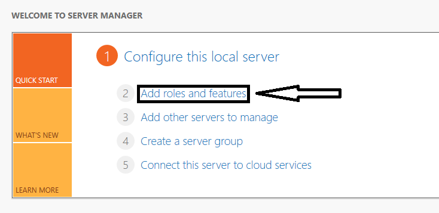
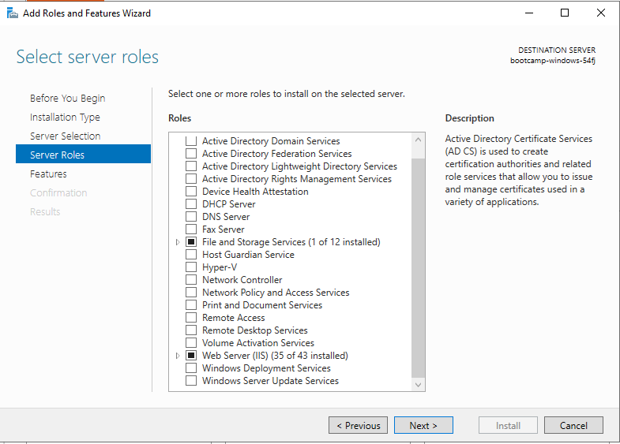
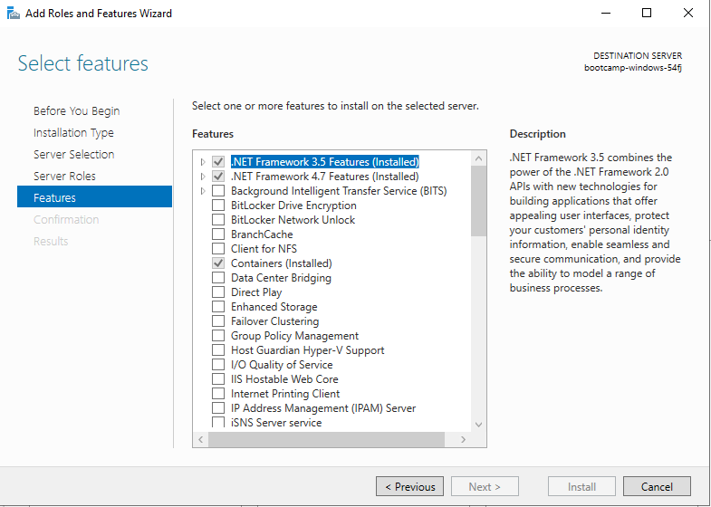
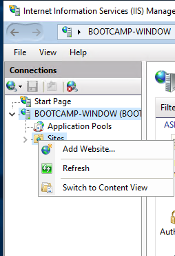
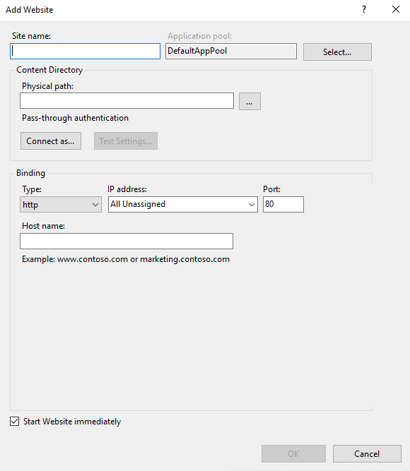
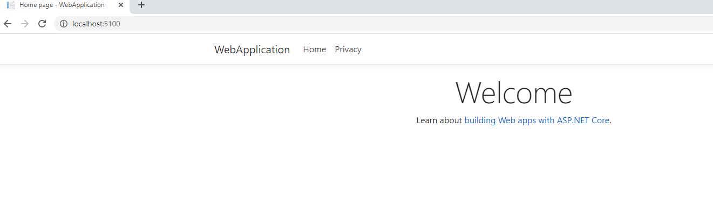

# IIS_WebApplication


Simple ASP.NET web application and deploy it on Microsoft machine.


## Description

This guide shows how to deploy an ASP.NET web application on your Microsoft machine,
using Internet Information Services (IIS) Manager.

## Requirements

- One server, running Windows Server operating system.

# Installation and Configuration

#### Step 1 - Clone\Create project.
```git clone``` this repository or create your own application for your Microsoft machine.
#### Step 2 - Create and configure IIS.
 - At the server manager click on : ```Add roles and feature```


 - Choose  ``` Web Server (IIS)``` at the ```Server Roles``` section.

 - Add the ```.NET framework``` features at the ``` Features``` section.
 - 

#### Step 3 - Add your web application to the IIS Manager.
- Open IIS manager
- Open your local connection.
- Right click on ``` Sites```
- Select add website



- Fill the website form.
  - ```Site name``` - Your website name.
  - ```Physical path``` - The path to your website folder.
  - ```port``` - The port where the app will run.




#### Step 4 - Browse to the application

- From your local Microsoft machine Browse to ```http://localhost:5100/```



# Dependencies 

 - Microsoft machine - This guide deployed with Windows Server 2019.

 - This project was written using Microsoft Visual Studio 2019 and C# ASP.NET 3.1 core,
other versions mat not work.

**Note** .NET versions must be the same on the server and at your project. 


